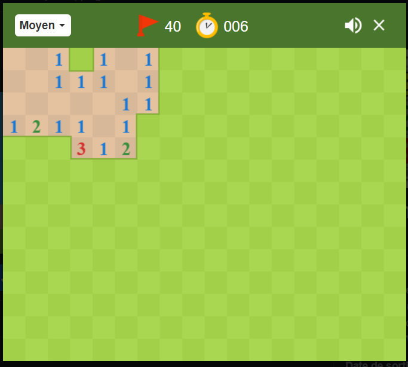
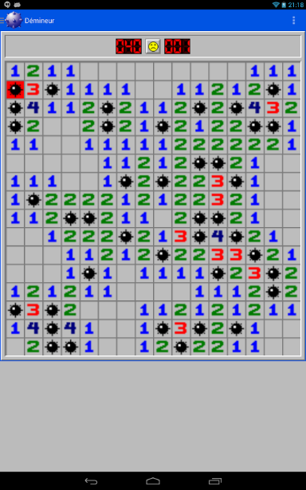
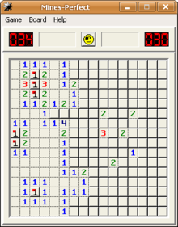
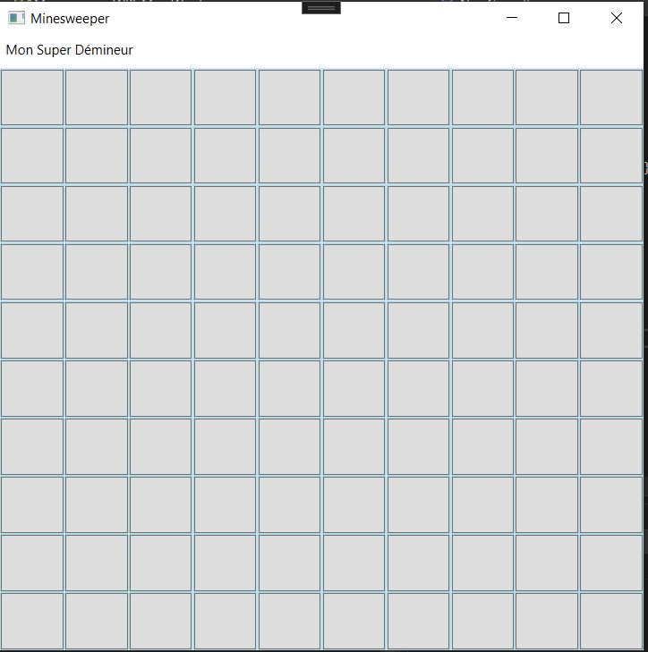
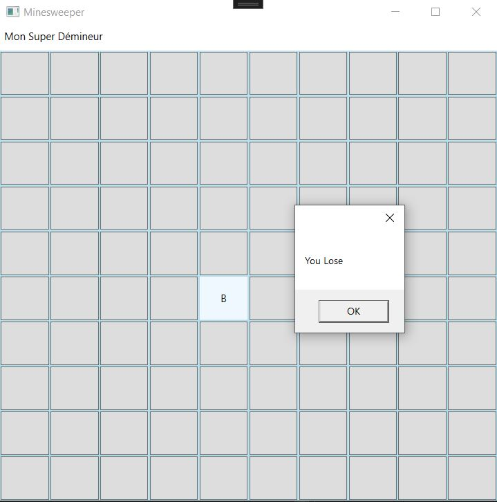
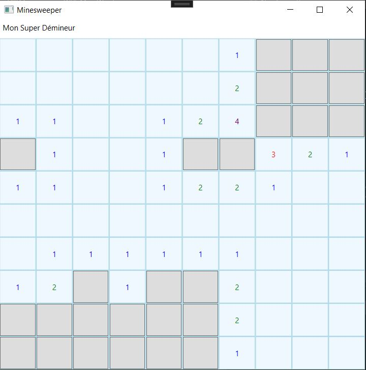
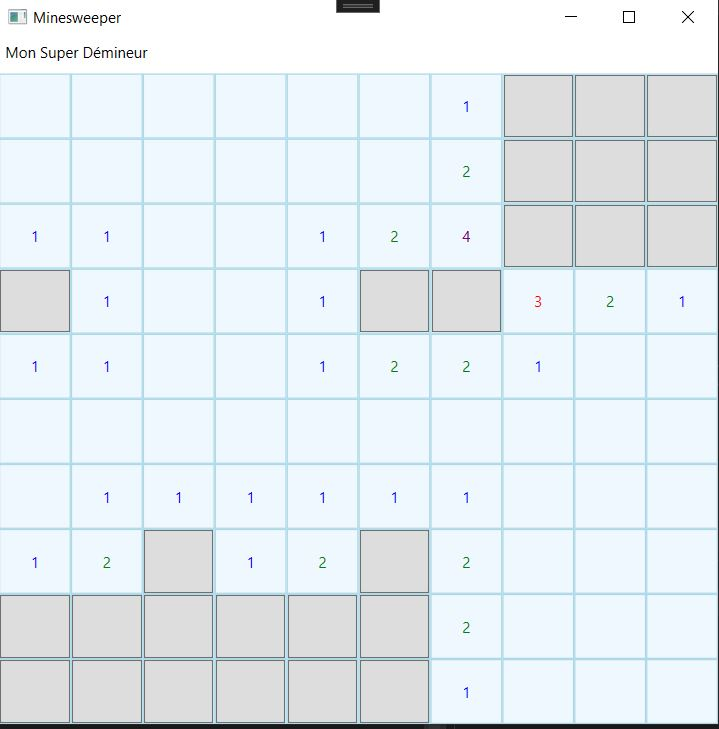
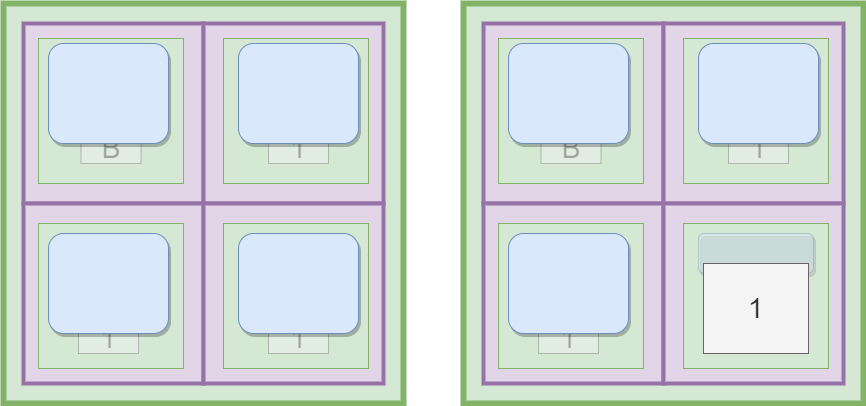

# Lab6 - The dynamic minesweeper

In this lab, we'll use code to add and remove controls to make our application dynamic, and we'll use Layouts to manage their automatic positioning.

# Work to hand in
At the end of the three sessions (a total of 6 hours' work), you'll be asked to submit your project using **travo**.

## The topic

Advancing in your studies is like advancing through a minefield. You have to take your time to analyze your environment, in order not to rush to the wrong answer. It's an important lesson, and that's why the IUT management wants to get it into your head by creating a minesweeper game.

### A minesweeper?

Here are some examples of games for the Minesweeper, which was a classic Windows game in previous versions. It is no longer integrated, but there are many alternative versions:





#### The aim of the game is as follows:  
The player plays on a grid whose cells are all hidden at start-up (some of which may contain bombs) and must reveal all cells that do not contain bombs. In some versions, this is supposed to be done as fast as possible.
 


To do this, they can click on a cell to reveal its contents. If the clicked cell contains a bomb, the game is immediately lost.



If the clicked cell did not contain a bomb, then the game can continue and part of the grid is uncovered by performing the following check:
- If the clicked cell (which didn't contain a bomb) has at least one bomb in its immediate vicinity (one cell around in all directions, even diagonally), then this cell reveals the number of bombs in this immediate vicinity and we stop there.
- On the other hand, if the clicked cell has no bombs in its immediate vicinity, then it reveals an empty square, and the game checks its immediate neighbors as well. From neighbor to neighbor, if many of the cells visited are empty and not surrounded by bombs, then a large part of the grid can be revealed with a single click.



There's a bit of luck involved at the start, as there are no clues as to where to click, but once numbers have been revealed, the aim of the game is to use these numbers to deduce where the bombs are likely to be.




From deduction to deduction, we'll try to find all the cells (empty and numbered) that don't contain bombs.
 
## Objectives :

Your application must allow you to manipulate certain parameters before starting a new game. In particular, the user needs to be able to choose the size of the grid (you can use square grids only, for simplicity) and the number of bombs.

There are two major challenges in this lab and you'll need to find information in the documentation / on the Internet to handle them : 

- The first is to correctly implement the dynamic creation of controls. The idea is that, at the start of each game, you create a new grid of controls. You'll need to do this from the code and you'll have to assign to these dynamically created controls the event-driven procedure you'll write, which will call the game's algorithms.
- The second challenge involves the algorithms that allow the game to function correctly. In particular, the algorithm that loops across the neighbors of a clicked cell is not trivial. This is a recursive algorithm, i.e. one that calls itself. You haven't yet seen this type of algorithm, but we'll give you a few hints later in this document.

As you can see, there are 3 sessions for this Lab, as there are several difficulties. Try to set objectives for each session. For example:
- 1st session: have a dynamic grid of controls when the application starts up, as well as the random placement of bombs in the game (without the game logic yet).
- 2nd session: have the main game algorithms implemented.
- 3rd session: have the menu for configuring the grid size, the number of bombs and restarting a new game. You can also customize your game with your own colors and animations!

## (1) Retrieve the project using **travo**
<details>
    <summary>See instructions here to retrieve and submit the project (important).</summary> 

> > To retrieve the project and submit it at the end of the two sessions, you'll need to use the **travo** script provided by the teacher responsable for this course. Download this script [**travoIHM.py**](https://ihm.gitpages.iut-orsay.fr/cours/travoIHM.py) to your personal space (somewhere in drive Z:).
> 
> **travo** is a set of Python scripts maintained by teachers & researchers from Paris-Saclay and Quebec, making it easier for teachers to use GIT. In fact, **travo** commands perform a set of GIT commands for you. Both **travo** and Python are already installed on IUT computers.
> > 
> > You can use your own computer and install **travo** on it (provided you've installed Python beforehand, of course) using the command
> > ```
> > pip install travo
> > ```
> 
> On the IUT computer, go to the C:WinPython directory and run the "WinPython Powershell Prompt.exe" program. A Powershell terminal will open, ready to receive Python commands.
> Inside this PowerShell terminal, first type the following command, enabling you to move to > your personal space:
> 
> ```
> cd Z:\
> ```
> 
> If you type the **ls** command, you should see the **travoIHM.py** script you downloaded earlier in the list of files in this directory (of course, you can work in a directory other than the root of the Z: directory).
> 
> To retrieve the project, simply type the command :
> 
> ```
> python travoIHM.py fetch tpihm6
> ```
> 
> You will be asked for your ADONIS (IUT) login information, and the project will be downloaded to your computer (in the "tpihm6" directory). 
> 
> Saving or submitting your work to your teacher will be done with the command : 
> ```
> python travoIHM.py submit tpihm6 ####
> ```
> You need to replace #### with your group ID **tp2a** or **tp2b** etc... Don't enter the wrong group, you'll lose points (if you've made a mistake, you can resubmit with the correct group and travo will correct the error, so don't panic).
> 
> You can submit as many times as you like. It's good practice not to lose your work.
>
> > ### Add a file to a project that has been retrieved
> > 
> > Most of the projects you'll retrieve with travo will contain all the files you need. However, you may need to add files (images, sounds, classes, etc.) to your projects, so that they can be found on the Git.
> > 
> > **travo** doesn't check for new files in your projects.
> > 
> > However, you can use the **git add** commands that you should have seen in [Qualité de développement](https://hoangla95.github.io/qualitedevs2/tp1) class by placing yourself in the project directory.
> >
> > Once the files have been added with the **git add** command, travo will take them into account during **submit**.

</details>

## Advice

My first piece of advice is to set aside the game's algorithms to get started. Concentrate on making a grid of buttons appear, so that when you click on each button, it displays its coordinate in a MessageBox. This is great for the first session!

### Attributes

Here are a few things that can help you with your application. First of all, you'll probably need to add some attributes to your class that will allow you to track the state of the game:
```
private int gridSize = 10;      // grid size
private int nbMines = 10;       // number of mines
private int nbCellsChecked = 0; // number of cells that have been checked (opened)
private int[,] matrix;          // matrix preserving grid values (see below)
```
The two-dimensional matrix is used to store the values of each cell:
- -1, this cell contains a bomb
- 0, this cell is empty and no neighboring cell contains a bomb
- n, with n>0, this square is empty and there are n neighboring squares around it containing a bomb

You could store these values directly in the controls you're going to add to your application (in the "Content" property of the "Label" present in the grid, for example), but you'll see that it's more practical to use a dedicated structure to which you can refer from anywhere in the code.

### Initialization procedure
You'll need to write a procedure that resets the game. Among other things, this procedure must:
- Reinitialize the grid and reset counters to zero
- Fill the grid with the controls you need
- Randomly place bombs by updating the matrix.

The begining of this initialization procedure should look like this (assuming you have a GRDGame grid added in XAML):
```
matrix = new int[gridSize, gridSize];
nbCellsChecked = 0;
GRDGame.Children.Clear();
GRDGame.ColumnDefinitions.Clear();
GRDGame.RowDefinitions.Clear();
for (int i = 0; i < gridSize; i++)
{
    GRDGame.ColumnDefinitions.Add(new ColumnDefinition() { Width = new GridLength(1, GridUnitType.Star) });
    GRDGame.RowDefinitions.Add(new RowDefinition() { Height = new GridLength(1, GridUnitType.Star) });
}
```
Observe how the grid is emptied of its children, row and column definitions, and how we reset the row and column definitions.

### Filling in the grid

Next, you'll need to code a loop which, at each turn of the loop, will create the contents of a cell and add it to the <span style="color:green">grid</span>. This is actually a double loop, as you'll need to loop on both columns (i) and rows (j).

```
Border b = new Border();
b.BorderThickness = new Thickness(1);
b.BorderBrush = new SolidColorBrush(Colors.LightBlue);
b.SetValue(Grid.RowProperty, j);
b.SetValue(Grid.ColumnProperty, i);
GRDGame.Children.Add(b);
```
In the following image I show you an example. The GRDGame grid is green and 2x2. In each cell of this grid, we would put a "b", a control of type <span style="color:purple">Border</span> (in purple in the image below) but that won't be enough. You'll also need to add a new <span style="color:green">grid</span> (in green) containing a new Label (in white, but hidden) and a new <span style="color:blue">Button</span> (in blue). Initially, the Label will be invisible and only the Button will be visible. Clicking on the Button will trigger the event procedure that controls the game logic. This procedure will (among other things) render the Button invisible and reveal the Label and its value (if the value is zero, it will also trigger on its neighbors, etc.).

<details>
    <summary>Why use a Grid in each Border?</summary>

> In order to easily manipulate the buttons and their respective hidden labels, it is best to group them in the application tree as well, by assigning them as children of one same control. Border controls only accept one child, therefore, I need a Layout control in the Border control to achieve this. I chose the Grid because the Grid will ensure that its children controls take as much space as they can (basically, they will fill their cell). You could have used a DockPanel or even a StackPanel...

</details>




To do this, you'll need to assign to this Button, just after instantiating it, the event procedure that implements the game logic .

### Position in the grid

In order to carry out the application, you will sometimes need to access a control located precisely at a grid coordinate, or to retrieve the coordinates of a control.

```
Button button = (Button)sender;
//Here I assume that in each grid cell, I have a Border containing a grid containing my button. 
Border b = (Border)VisualTreeHelper.GetParent(VisualTreeHelper.GetParent(button));
int col = Grid.GetColumn(b);
int row = Grid.GetRow(b);
```

As a gift, a function that returns the control located in a grid at given coordinates:
```
private UIElement GetUIElementFromPosition(Grid g, int col, int row)
{
    return g.Children.Cast<UIElement>().First(e => Grid.GetRow(e) == row && Grid.GetColumn(e) == col);
}
```

### Pseudo-code of the recursive algorithm 

The big part of the minesweeper is its recursive algorithm, which means we have a method that calls itself. We'll call this function checkCell in the rest of the document.

I'm going to explain to you the general principle of this function.

We suppose that I've clicked on the button located at coordinates (column, row). So I need to call the checkCell procedure, which will check if there is a bomb at these coordinates. 
- If there is, the algorithm stops and the game is lost. 
- If there isn't, I have to remove the button (make it invisible) in order to display the number of neighboring bombs (by making the Label visible and putting the corresponding number from the matrix).
    - If this number is greater than zero, we stop here.
    - If the number is equal to zero, then I have to call again checkCell on all neighboring cells! This is where the recursive aspect of this function comes in!

You'll need to be careful when checking a neighboring cell that its coordinates aren't outside the grid (the pseudo-code shows you how to do this, the Max function returns the largest value between 2 values and the Min function returns the smallest value between 2 values, both of which exist in C# in the Math library).

#### Pseudo-Code 
```
Boolean function checkCell(integer column, integer row)
{
    IF the cell has not already been checked (the button is still visible/active)
    THEN {
        Hide/deactivate the button and display the value of this cell
        IF the cell is a bomb 
        THEN{ game lost, reset the game; return TRUE }
        ELSE{ 
            IF it was the last cell to be checked 
            THEN{ game won, reset the game; return TRUE}
            ELSE{
                //Check the value of this cell
                IF matrix[column,row] is 0 (no bombs around) 
                THEN{	
                    // the procedure calls itself on neighboring cells
                    FOR i from Max(0, column-1) to Min(gridsize -1, column+1) {
                        FOR j from Max(0, row-1) to Min(gridsize -1, row+1){
                            Boolean resultat = checkCell(i,j)
                            IF resultat equals TRUE
                            THEN{ return TRUE }
                        }
                    }
                }
            }
        }
    }
    return FALSE
}

```
### Submit your work
Don't forget to submit your work to your teacher with the **travo** command. 
```
python travoIHM.py submit tpihm6 ####
```
> replacing #### with your group ID **tp2a** or **tp2b** etc... Once again, don't get the wrong group...